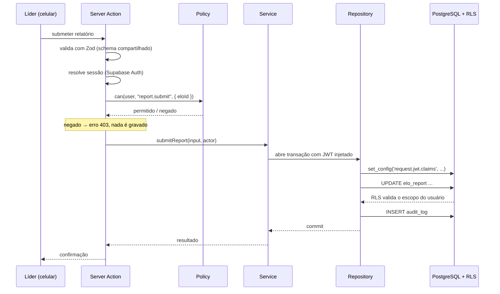

# Arquitetura — Renovo Conecta

- **Versão:** 1.0 · **Data:** 2026-07-25
- Decisões que originaram este documento: `DECISIONS.md` (ADR-001 a ADR-004).

---

## 1. Visão geral

Monolito modular em **Next.js (App Router)**, organizado **por domínio** e não por tipo de arquivo. Um único deploy, uma única base de código, fronteiras internas explícitas.

A escolha por monolito é deliberada: a igreja tem uma equipe de desenvolvimento pequena, e microsserviços introduziriam custo operacional sem resolver nenhum problema real do produto. A modularização interna preserva a possibilidade de extrair um domínio no futuro, caso algum justifique.

```
┌──────────────────────────────────────────────┐
│  Navegador / PWA instalado                   │
│  Server Components · Client Components       │
└───────────────────┬──────────────────────────┘
                    │ HTTPS
┌───────────────────▼──────────────────────────┐
│  Next.js (Vercel)                            │
│  Server Actions · Route Handlers · Middleware│
│  Policies → Services → Repositories          │
└───────────────────┬──────────────────────────┘
                    │ PostgreSQL (com JWT do usuário)
┌───────────────────▼──────────────────────────┐
│  Supabase                                    │
│  PostgreSQL + RLS · Auth · Storage privado   │
└──────────────────────────────────────────────┘
```

---

## 2. Camadas

```
UI (Server / Client Components)
   │   nunca acessa o banco diretamente
   ▼
Actions / Route Handlers
   │   valida a entrada com Zod · resolve a sessão
   ▼
Policies — can(user, action, resource)
   │   autorização explícita · deny by default
   ▼
Services
   │   regra de negócio · transação · emissão de AuditLog
   ▼
Repositories (Drizzle)
   │   única porta de acesso ao banco
   ▼
PostgreSQL + Row Level Security
       rede de segurança final
```

### Responsabilidade de cada camada

| Camada          | Faz                                                          | Não faz                             |
| --------------- | ------------------------------------------------------------ | ----------------------------------- |
| **UI**          | Renderiza, esconde o que o usuário não pode ver              | Decidir autorização; acessar banco  |
| **Action**      | Valida entrada (Zod), resolve sessão, chama policy e service | Regra de negócio; SQL               |
| **Policy**      | Responde "este usuário pode esta ação neste recurso?"        | Efeitos colaterais                  |
| **Service**     | Orquestra regra de negócio, abre transação, emite `AuditLog` | Ler `request`/`headers` diretamente |
| **Repository**  | Traduz intenção em query Drizzle                             | Autorizar; regra de negócio         |
| **Banco (RLS)** | Recusa linhas fora do escopo do usuário                      | Substituir a validação da aplicação |

**Regra:** a UI esconder um botão é conveniência, nunca segurança. Toda ação sensível é validada no servidor **e** protegida por RLS.

---

## 3. Fluxo de uma requisição

Exemplo — líder envia o relatório semanal:



---

## 4. Autorização em três camadas

### Camada 1 — Interface

Esconde menus, botões e campos que o usuário não pode usar. **Somente experiência de uso.**

### Camada 2 — Servidor

Toda Server Action e todo Route Handler executa `can(user, action, resource)` **antes** de qualquer efeito. Deny by default: uma ação sem policy declarada é negada.

O motor de permissões combina **papel + escopo**:

| Escopo         | Significado                                  |
| -------------- | -------------------------------------------- |
| `global`       | Toda a plataforma (apenas superadmin)        |
| `congregation` | Toda a congregação                           |
| `supervision`  | Somente os Elos atribuídos àquele supervisor |
| `elo`          | Somente o Elo do qual é líder ou vice        |
| `self`         | Somente os próprios dados                    |

### Camada 3 — Banco (Row Level Security)

Cada tabela de domínio tem políticas que filtram por `tenant_id`, `congregation_id` e pelo escopo do usuário, lidos das claims do JWT. Mesmo um bug na aplicação não expõe dados de outro Elo ou de outra congregação.

Detalhamento por tabela em `PERMISSIONS.md`.

---

## 5. Drizzle e RLS convivendo (ADR-001)

Toda query originada de requisição de usuário roda dentro de uma transação que injeta as claims antes de qualquer consulta:

```
withUserContext(session, async (tx) => {
  // executa: set_config('request.jwt.claims', <claims>, true)
  // a partir daqui, todas as queries são filtradas pela RLS
  return tx.select()...
})
```

**Regras de uso:**

1. Repositórios **nunca** expõem a conexão crua — recebem a transação (`tx`) como parâmetro.
2. A conexão `service_role` (que ignora RLS) vive em módulo isolado, com import proibido fora dele por regra de ESLint. Uso permitido apenas em migrations, seeds e jobs administrativos explícitos — **nunca** em handler de requisição de usuário.
3. Toda tabela nova nasce com RLS habilitada e política de negação padrão. Uma tabela sem teste de isolamento não vai para produção.

---

## 6. Estrutura de pastas

```
src/
  app/
    (auth)/            login · recuperar-senha · aceitar-convite
    (app)/             área autenticada
      dashboard/
      pessoas/
      elos/
      relatorios/
      estudos/
      usuarios/
      configuracoes/
      auditoria/
      privacidade/
    api/               webhooks e endpoints que não cabem em Server Actions
    layout.tsx  manifest.ts  robots.ts

  modules/
    auth/  people/  elos/  reports/  studies/  dashboard/  audit/  privacy/
      actions.ts       entrada: valida → autoriza → chama service
      service.ts       regra de negócio, transação, auditoria
      repository.ts    acesso a dados via Drizzle
      schemas.ts       schemas Zod compartilhados cliente/servidor
      policies.ts      regras de autorização do domínio
      components/      UI específica do domínio
      __tests__/

  core/
    auth/              sessão, convites, guardas de rota
    authz/             motor de permissões, papéis, escopos, can()
    db/
      client.ts        conexão Drizzle do usuário
      admin.ts         conexão service_role — IMPORT RESTRITO
      schema/          definição das tabelas
      with-user-context.ts   helper de transação com JWT
    audit/             emissão padronizada de AuditLog
    errors/            erros de domínio e tradução para resposta HTTP
    logging/           logger estruturado com scrubbing de dados pessoais
    config/            leitura e validação das variáveis de ambiente (Zod)

  components/ui/       design system próprio (base shadcn/ui)
  lib/                 formatação BR (telefone, CEP, data, moeda), utilitários

supabase/
  migrations/          SQL versionado (gerado por Drizzle + políticas RLS à mão)
  seeds/               dados 100% fictícios

tests/
  unit/  integration/  rls/  e2e/

docs/
```

### Convenções

- Rotas e pastas de rota em **português** (`/pessoas`, `/elos`) — o usuário final é brasileiro.
- Código, tipos e nomes de tabela em **inglês** (`Person`, `elo_report`) — consistência técnica.
- `Elo` permanece `Elo` em ambos: é o nome do domínio da igreja, não uma tradução.
- Um módulo **não importa** o `repository` de outro. A comunicação entre domínios passa pelo `service`.

---

## 7. Validação

Um único schema Zod por operação, em `modules/<dominio>/schemas.ts`, usado nos dois lados:

- **Cliente** — React Hook Form com `zodResolver`, feedback imediato.
- **Servidor** — a Server Action revalida **sempre**, mesmo que o cliente já tenha validado. A validação do cliente é conveniência; a do servidor é a que vale.

---

## 8. Tratamento de erros

Erros de domínio tipados (`NotFoundError`, `ForbiddenError`, `ValidationError`, `ConflictError`) traduzidos em respostas seguras.

**Regra crítica:** mensagens de erro exibidas ao usuário **nunca** contêm dados pessoais, identificadores internos ou detalhes de infraestrutura. Não confirme existência de recurso ao qual o usuário não tem acesso — retorne o mesmo resultado para "não existe" e "não autorizado", evitando enumeração.

---

## 9. Observabilidade

- **Logs estruturados** em JSON, com `requestId`, `userId`, ação e resultado. **Nunca** nome, telefone, e-mail, endereço ou conteúdo pastoral.
- **Sentry** com scrubbing configurado antes do envio.
- **`AuditLog`** é diferente de log de aplicação: registro de negócio, append-only, no banco, consultável pelos administradores.

---

## 10. Ambientes

| Ambiente      | Banco                        | Deploy              | Dados                                        |
| ------------- | ---------------------------- | ------------------- | -------------------------------------------- |
| `local`       | Supabase local (Docker)      | —                   | Somente seeds fictícios                      |
| `homologação` | Projeto Supabase separado    | Preview da Vercel   | Somente seeds fictícios                      |
| `produção`    | Projeto Supabase de produção | Vercel (**manual**) | Dados reais, após validação jurídica de LGPD |

**Nenhum dado real de igreja em local ou homologação. Nenhum deploy automático.**

---

## 11. Decisões arquiteturais explicitamente adiadas

Registradas para evitar reabertura sem necessidade:

- **Fila de jobs** — não há no MVP. Publicação agendada de estudo resolve-se por verificação de data na leitura.
- **Cache distribuído** — não há. Cache do Next.js e índices do Postgres são suficientes na escala atual.
- **Camada de integração de pagamento** — apenas prevista na modelagem; nenhum código na Prioridade 1.
- **Offline-first** — descartado no MVP (ADR-004); apenas rascunho local do relatório.
- **Microsserviços / extração de domínio** — reavaliar apenas se algum domínio justificar por escala real.
