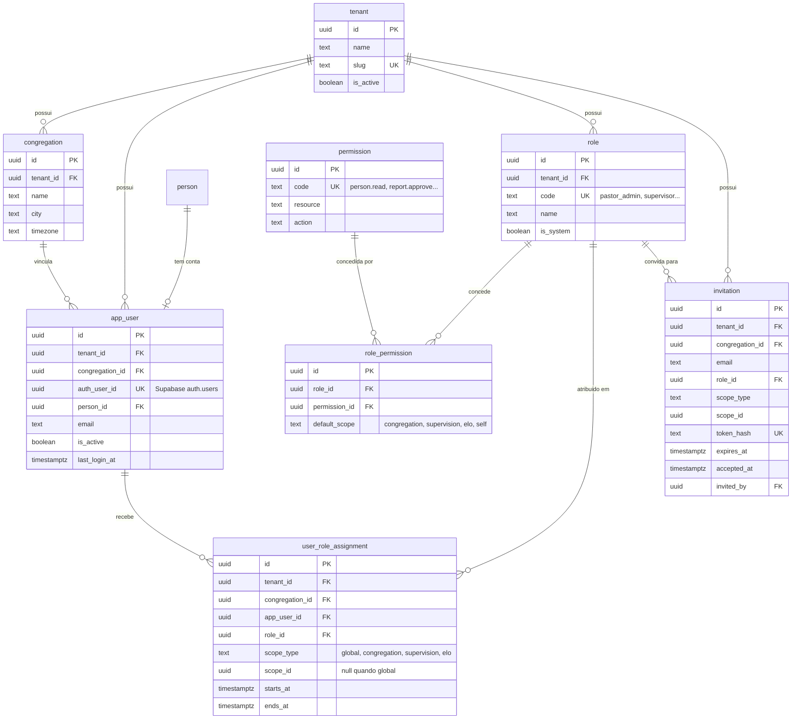
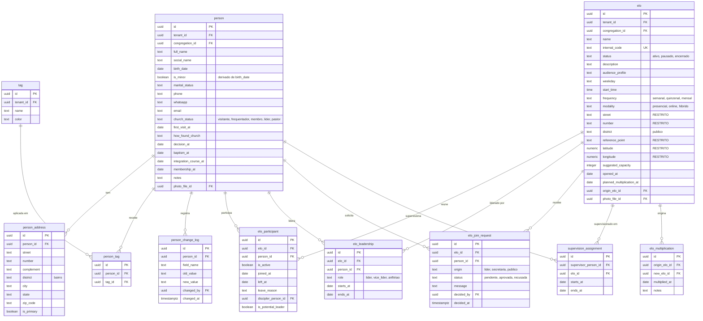
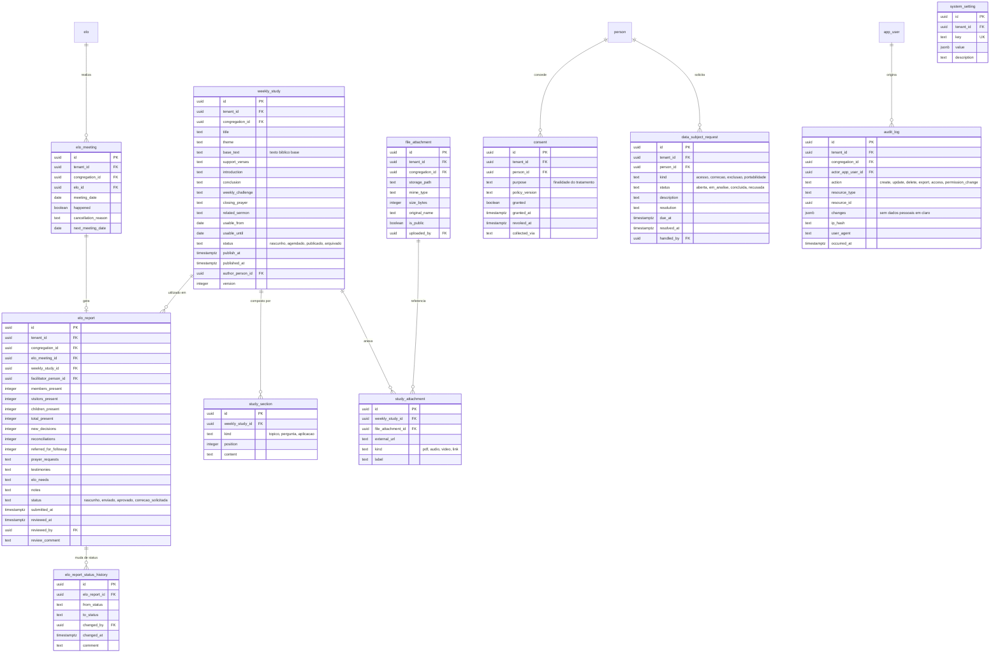

# Modelo de dados — Renovo Conecta

- **Versão:** 2.0 · **Data:** 2026-07-25 · **Status:** núcleo implementado na Fase 3
- **Banco:** PostgreSQL 17 (Supabase) · **ORM:** Drizzle (ADR-001)
- **Escopo:** entidades da Prioridade 1 (MVP). Entidades reservadas, sem implementação, estão na seção 8.

> Este documento precede qualquer migration. Nenhuma tabela é criada antes de constar aqui.

**Implementado na Fase 3** — 22 tabelas, 11 tipos `enum`, 24 índices:

| Grupo                | Tabelas                                                                                                        | Definição em                     |
| -------------------- | -------------------------------------------------------------------------------------------------------------- | -------------------------------- |
| Tenancy              | `tenant`, `congregation`, `system_setting`                                                                     | `src/core/db/schema/tenancy.ts`  |
| Identidade           | `person`, `app_user`, `person_address`, `tag`, `person_tag`, `person_change_log`                               | `src/core/db/schema/identity.ts` |
| Acesso               | `role`, `permission`, `role_permission`, `user_role_assignment`, `invitation`                                  | `src/core/db/schema/access.ts`   |
| Elos                 | `elo`, `elo_leadership`, `elo_participant`, `elo_join_request`, `supervision_assignment`, `elo_multiplication` | `src/core/db/schema/elos.ts`     |
| Auditoria e arquivos | `audit_log`, `file_attachment`                                                                                 | `src/core/db/schema/audit.ts`    |

Migrations: `supabase/migrations/0000_core_schema.sql` (gerada e revisada) e
`0001_rls_policies.sql` (escrita à mão).

**Ainda não implementadas:** relatórios semanais (Fase 8), estudos (Fase 9),
consentimentos e solicitações do titular (Fase 11) — ver seção 8.

---

## 1. Convenções

Toda tabela de domínio carrega:

| Coluna            | Tipo          | Observação                                                            |
| ----------------- | ------------- | --------------------------------------------------------------------- |
| `id`              | `uuid`        | PK, gerada pelo banco (`gen_random_uuid()`)                           |
| `tenant_id`       | `uuid`        | FK → `tenant`. **Obrigatória** (ADR-002)                              |
| `congregation_id` | `uuid`        | FK → `congregation`. Obrigatória, exceto em `tenant` e `congregation` |
| `created_at`      | `timestamptz` | `default now()`                                                       |
| `updated_at`      | `timestamptz` | atualizada por trigger                                                |
| `deleted_at`      | `timestamptz` | soft delete; `null` = ativo                                           |
| `created_by`      | `uuid`        | FK → `app_user`, nullable (seeds e sistema)                           |
| `updated_by`      | `uuid`        | FK → `app_user`, nullable                                             |

**Regras gerais:**

- Chaves primárias sempre UUID — nunca inteiro sequencial, para não vazar volume nem permitir enumeração em URLs.
- Toda FK tem `ON DELETE RESTRICT` por padrão. Exclusão real é exceção; o caminho normal é soft delete.
- Todo índice de busca inclui `tenant_id` como primeira coluna.
- Datas e horários em `timestamptz`, armazenados em UTC e exibidos em `America/Bahia`.
- Textos livres em `text`; nunca `varchar(n)` arbitrário.
- Enumerações em tabelas de domínio ou tipos `enum` do Postgres, nunca strings soltas.
- **RLS habilitada em todas as tabelas, com política de negação padrão.** Ver `PERMISSIONS.md`.
- `audit_log` é **append-only**: sem `UPDATE`, sem `DELETE`, sem soft delete.

---

## 2. Diagrama ER — Tenancy, usuários e permissões

**Notas:**

- `app_user` liga a conta de autenticação do Supabase (`auth_user_id`) a uma `person`. Uma pessoa pode existir sem conta — é o caso de todos os membros e visitantes no MVP (ADR-003).
- `user_role_assignment` é o coração do controle de acesso: o mesmo usuário pode ser **líder do Elo X** e **supervisor da área Y** simultaneamente. `scope_id` aponta para `elo.id` quando `scope_type = 'elo'`.
- `invitation.token_hash` guarda **hash** do token, nunca o token em claro.

---

## 3. Diagrama ER — Pessoas e Elos

**Notas:**

- **Privacidade do endereço do Elo:** `street`, `number`, `reference_point`, `latitude` e `longitude` são campos restritos. Quem não tem permissão vê apenas `district`, dia, horário e perfil. A restrição é aplicada por RLS em coluna (view) **e** na camada de serviço — não apenas escondendo na interface.
- `elo_leadership` é histórico, com vigência: permite saber quem liderava o Elo em determinada data.
- `elo_participant` mantém `joined_at` e `left_at` para reconstruir a trajetória da pessoa.
- `supervision_assignment` liga supervisor a Elos **diretamente**, sem camada de setor (premissa registrada no PRD).
- `is_minor` é derivado de `birth_date` e existe para simplificar as políticas de acesso a dados de crianças e adolescentes (LGPD, Art. 14).

---

## 4. Diagrama ER — Relatórios, estudos e transversais

**Notas:**

- `elo_meeting` e `elo_report` são separados de propósito: um encontro pode existir sem relatório (é exatamente isso que o dashboard precisa detectar — "Elos sem relatório"), e o campo `happened = false` registra encontro cancelado com motivo.
- `total_present` é armazenado e **validado no servidor** contra a soma das parcelas, para permitir consultas agregadas rápidas sem recalcular.
- `weekly_study.status = 'agendado'` com `publish_at` no futuro: a publicação é resolvida por verificação de data na leitura, sem job (ver `ARCHITECTURE.md` §11).
- `file_attachment` sempre aponta para Storage **privado**; o acesso se dá por URL assinada de curta duração.
- `audit_log.changes` guarda **quais campos** mudaram, não necessariamente os valores. Campos sensíveis registram apenas o nome do campo. `ip_hash` guarda hash, nunca o IP em claro.

---

## 5. Índices previstos

| Tabela                   | Índice                                    | Motivo                                    |
| ------------------------ | ----------------------------------------- | ----------------------------------------- |
| `person`                 | `(tenant_id, congregation_id, full_name)` | Busca por nome                            |
| `person`                 | `(tenant_id, church_status)`              | Filtro por situação                       |
| `person`                 | GIN sobre `full_name` (trigram)           | Busca parcial e tolerante a acento        |
| `person_address`         | `(person_id, is_primary)`                 | Endereço principal                        |
| `person_address`         | `(tenant_id, district)`                   | Filtro por bairro                         |
| `elo`                    | `(tenant_id, congregation_id, status)`    | Lista de Elos ativos                      |
| `elo_participant`        | `(elo_id, is_active)`                     | Participantes ativos                      |
| `elo_participant`        | `(person_id, is_active)`                  | "Meu Elo"                                 |
| `supervision_assignment` | `(supervisor_person_id, ends_at)`         | Escopo do supervisor — **usado pela RLS** |
| `elo_meeting`            | `(tenant_id, elo_id, meeting_date)`       | Encontros por período                     |
| `elo_report`             | `(tenant_id, status, submitted_at)`       | Elos sem relatório / atrasados            |
| `weekly_study`           | `(tenant_id, status, publish_at)`         | Estudo da semana                          |
| `audit_log`              | `(tenant_id, occurred_at)`                | Consulta cronológica                      |
| `audit_log`              | `(resource_type, resource_id)`            | Histórico de um recurso                   |
| `invitation`             | `(token_hash)`                            | Resolução do convite                      |

Os índices usados pelas políticas de RLS são críticos: sem eles, cada consulta de supervisor faz varredura completa.

---

## 6. Restrições de integridade

- `elo.internal_code` — único por `tenant_id`.
- `elo_participant` — único por `(elo_id, person_id)` entre registros ativos.
- `elo_leadership` — no máximo um `lider` ativo por Elo em uma mesma data.
- `elo_report` — único por `elo_meeting_id` (um relatório por encontro).
- `elo_meeting` — único por `(elo_id, meeting_date)`.
- `app_user.auth_user_id` — único.
- `consent` — histórico completo, sem sobrescrita: revogação cria transição, não apaga o registro.
- `audit_log` — sem `UPDATE` nem `DELETE`, garantido por permissão de banco e por trigger.
- `person.birth_date` — não pode ser futura.
- `elo_report` — soma das parcelas de presença precisa bater com `total_present` (validado no serviço e por `CHECK`).

---

## 7. Estratégia de migrations

- Migrations geradas por Drizzle a partir do schema, revisadas manualmente antes de aplicar.
- **Políticas de RLS são escritas à mão**, em arquivos SQL versionados junto às migrations — nunca geradas automaticamente.
- Toda migration precisa aplicar do zero de forma reprodutível (verificado no CI).
- Migrations destrutivas exigem ADR registrado em `DECISIONS.md`.
- Ordem de aplicação: schema → índices → políticas de RLS → seeds (apenas em `local` e `homologação`).

---

## 8. Entidades reservadas (sem implementação no MVP)

Presentes no planejamento para evitar migração destrutiva no futuro. **Não recebem tabela nem código na Prioridade 1.**

| Entidade                                                              | Fase         | Observação                                                                         |
| --------------------------------------------------------------------- | ------------ | ---------------------------------------------------------------------------------- |
| `pastoral_note`                                                       | Prioridade 2 | **Dado altamente restrito** — RLS mais rígida e log de todo acesso desde o desenho |
| `prayer_request`                                                      | Prioridade 2 | Idem; inclui níveis de visibilidade e anonimato                                    |
| `journey_stage`, `person_journey`                                     | Prioridade 2 | Jornada configurável                                                               |
| `follow_up_task`                                                      | Prioridade 2 | Tarefas de acompanhamento                                                          |
| `ministry`, `ministry_member`, `volunteer_role`, `volunteer_schedule` | Prioridade 2 | Ministérios e escalas                                                              |
| `event`, `event_ticket_type`, `event_registration`, `event_check_in`  | Prioridade 2 | Eventos e check-in                                                                 |
| `announcement`, `notification`                                        | Prioridade 2 | Comunicação                                                                        |
| `donation`, `transaction`                                             | Prioridade 3 | **Acesso financeiro segregado**; nunca visível a líder, vice ou supervisor         |

---

## 9. Dados de demonstração

Todos os seeds usam **dados 100% fictícios**. Catálogo em `DEMO_DATA.md`.

**Nunca** use dados reais da Igreja Renovo em seeds, testes, capturas de tela ou ambientes de desenvolvimento e homologação.
