# Fluxos principais — Renovo Conecta

- **Versão:** 1.0 · **Data:** 2026-07-25
- Escopo: fluxos do MVP (Prioridade 1). Cada fluxo indica quem executa, o que o servidor verifica e o que fica registrado.

---

## 1. Convite e primeiro acesso

Único caminho de criação de conta no MVP (ADR-003).

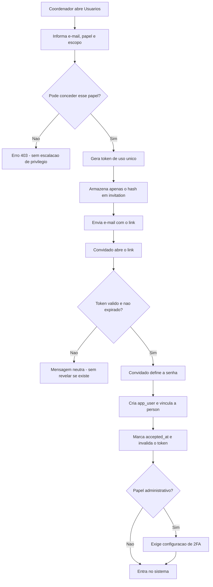

**Verificações no servidor:** anti-escalação de privilégio; token de uso único com expiração de 7 dias; apenas o hash é armazenado.
**Auditoria:** `invitation.created`, `user.created`, `role.assigned`.

---

## 2. Login

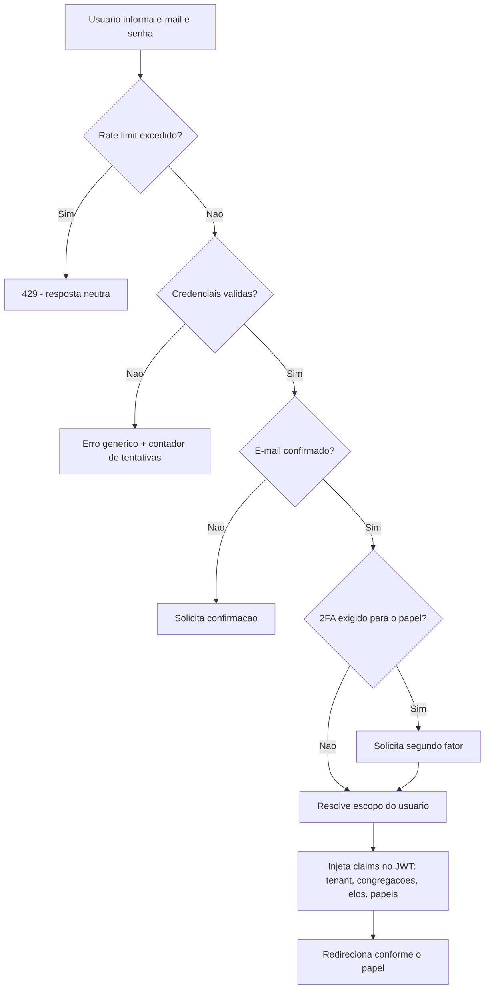

**Resposta uniforme:** e-mail inexistente e senha errada produzem a mesma mensagem e tempo aproximado.
**Auditoria:** `auth.login_success`, `auth.login_failed`.

---

## 3. Cadastro de pessoa

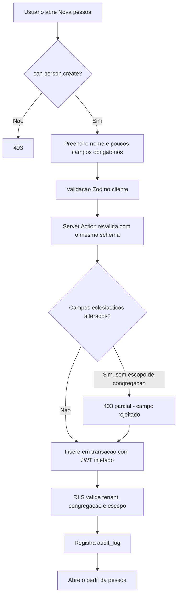

**Nota:** líder e supervisor podem criar **visitantes** e editar contato, mas não alteram batismo, membresia ou decisão — ver `PERMISSIONS.md` §4, notas 3 e 4.

---

## 4. Criação de Elo e vínculo de supervisão

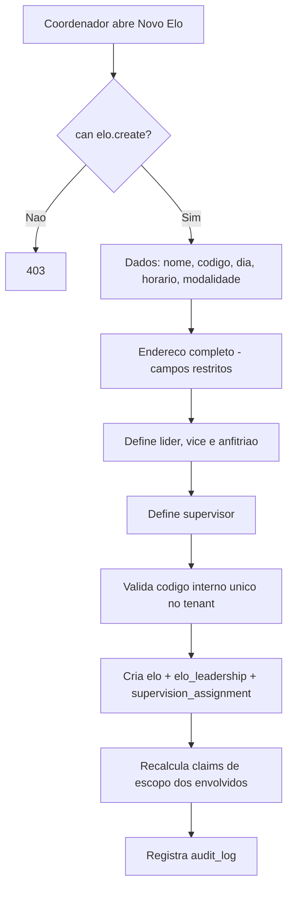

**Ponto crítico:** ao criar o vínculo, as claims do líder e do supervisor são recalculadas **imediatamente** — não esperam a sessão expirar.

---

## 5. Solicitação de participação em Elo

No MVP, a solicitação é registrada por um líder ou pela secretaria (ADR-003). O campo `origin` já prevê a abertura pública na Prioridade 2.

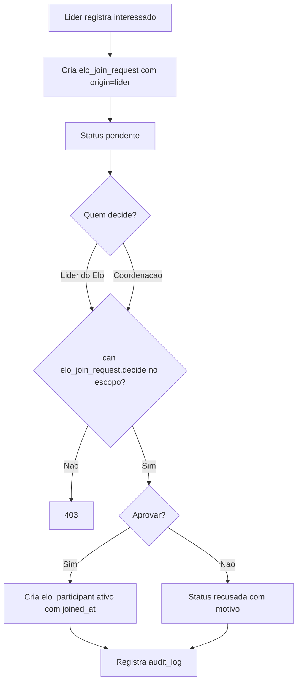

---

## 6. Relatório semanal — fluxo mais importante do produto

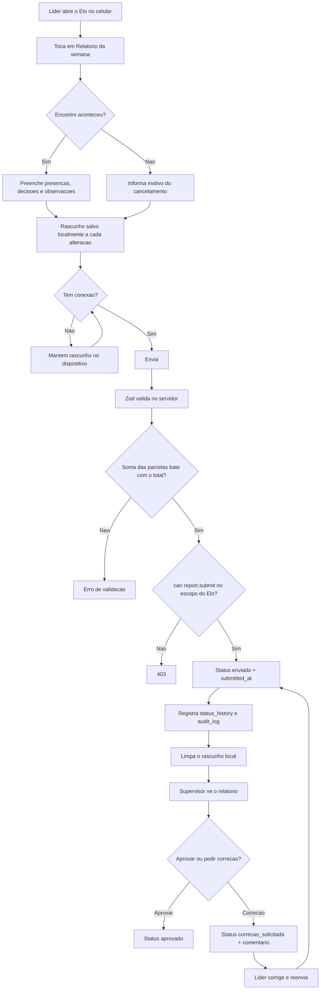

**Regras:** o líder **não** aprova o próprio relatório. O rascunho local é apagado após o envio bem-sucedido e no logout (ADR-004 e `LGPD.md` §7).

---

## 7. Publicação do estudo semanal

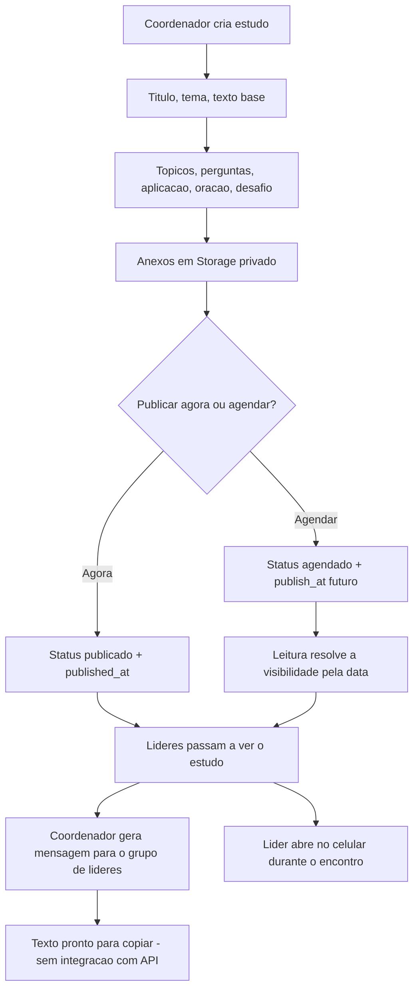

**Nota:** rascunhos e agendados **não** são visíveis a líder nem supervisor (`PERMISSIONS.md` §5).

---

## 8. Supervisor acompanha seus Elos

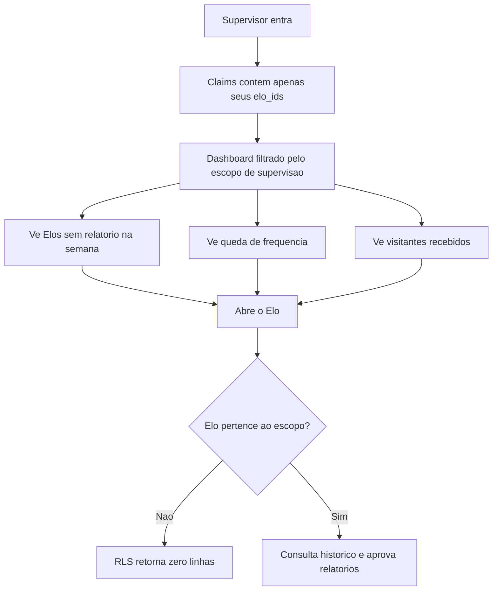

**Teste obrigatório:** tentar acessar um Elo fora do escopo, por URL direta, retorna o mesmo resultado de "não existe" — sem revelar que o recurso existe.

---

## 9. Multiplicação de Elo

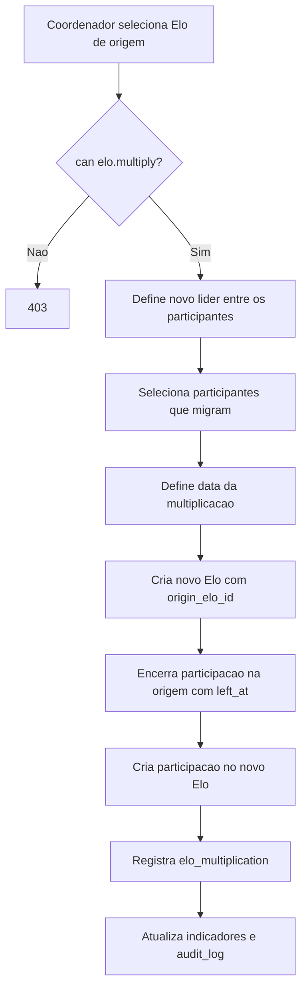

Nenhum histórico é apagado: a trajetória da pessoa continua reconstruível.

---

## 10. Solicitação do titular dos dados

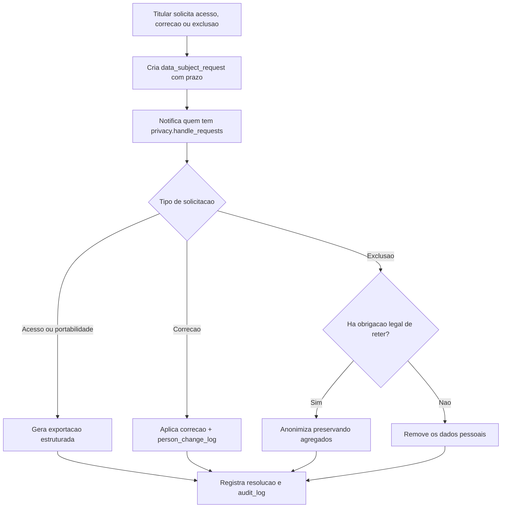

**Nota:** exclusão usa **anonimização** quando é preciso preservar histórico agregado — a contagem de presentes em um relatório antigo continua correta sem identificar ninguém (`LGPD.md` §4).

---

## 11. Consulta ao log de auditoria

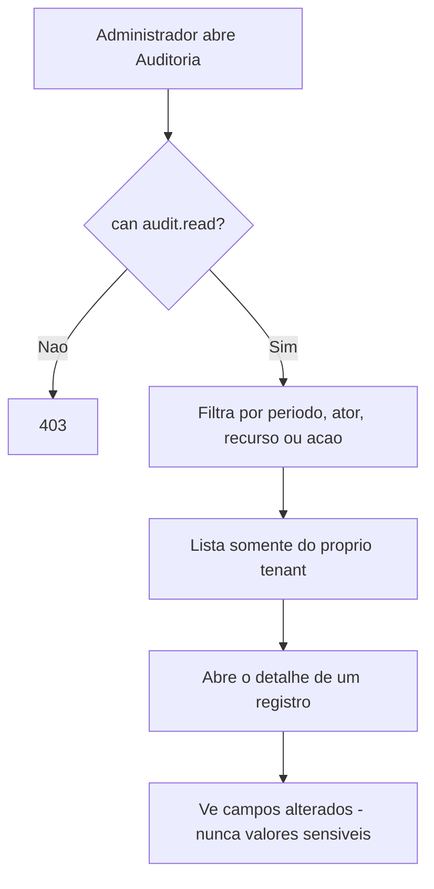

`audit_log` é append-only: não existe caminho de alteração ou exclusão na interface nem no banco.

---

## 12. Estados de tela obrigatórios

Todo fluxo acima precisa cobrir, na implementação:

| Estado            | Exigência                                                                             |
| ----------------- | ------------------------------------------------------------------------------------- |
| **Carregando**    | Skeleton, nunca tela em branco                                                        |
| **Vazio**         | Texto acolhedor + ação sugerida ("Nenhum Elo cadastrado ainda. Criar o primeiro Elo") |
| **Erro**          | Mensagem compreensível, sem jargão técnico e sem dado pessoal                         |
| **Sem permissão** | Mesma resposta de "não encontrado", para não revelar existência                       |
| **Offline**       | Aviso claro; rascunho preservado no formulário de relatório                           |
| **Confirmação**   | Diálogo explícito antes de qualquer ação destrutiva                                   |
| **Sucesso**       | Confirmação visível, especialmente no envio do relatório                              |
